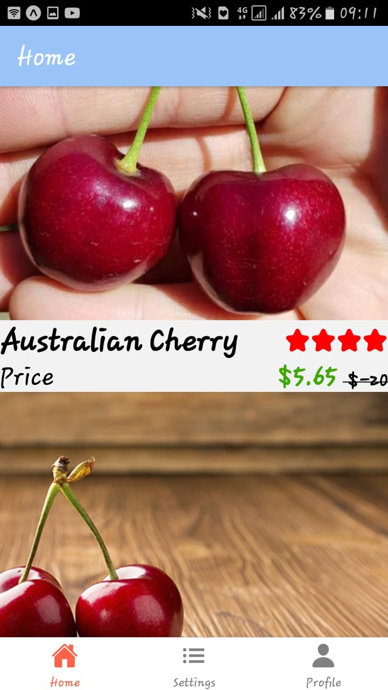
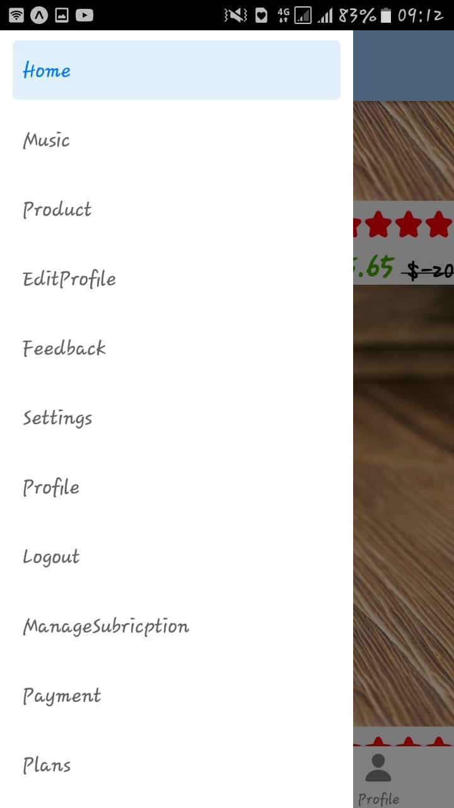
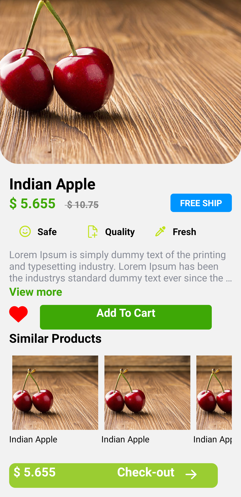
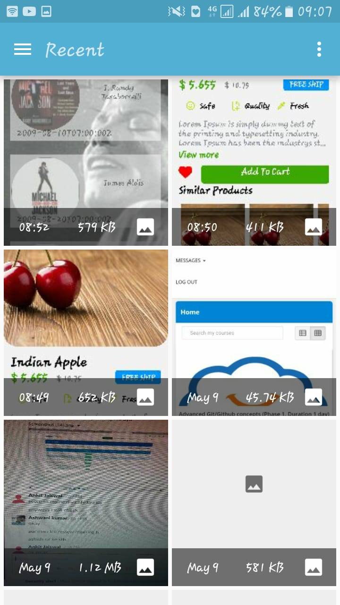

# React-native- project using (Expo)

## This task includes all the topics that i have learnt during building it:-

1. How to make splash screen.
2. How to build screens.
3. How to make a login screen.
4. Navigation - stack, drawer, bottom tab.
5. Fetching data from a api.
6. How to pass props.
7. Implement integrated camera.
8. How to make reusable components.

#### These are the screens

  

#### Music Screen

